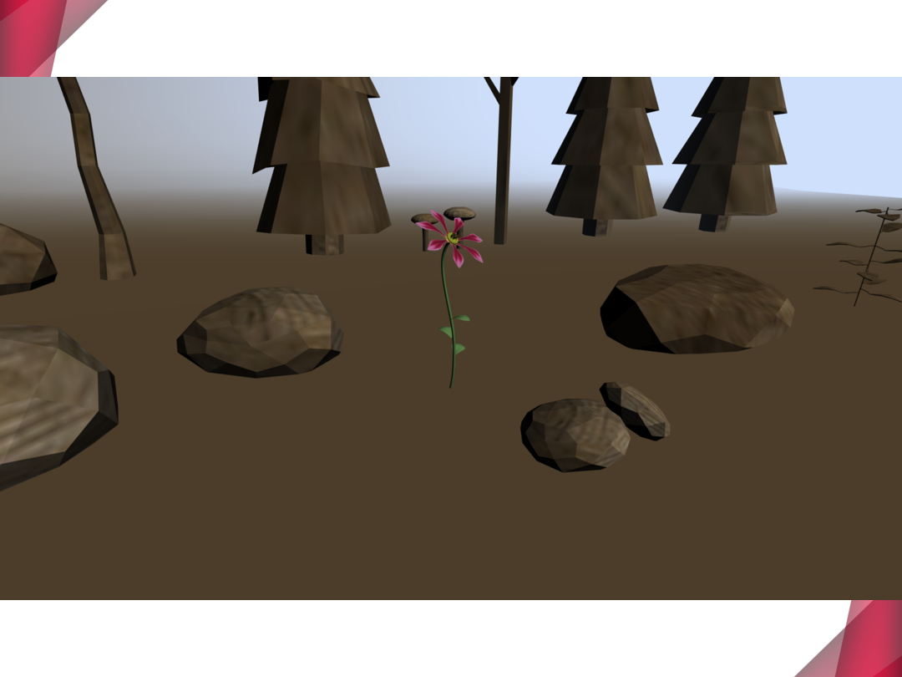

WebFlowers
===

A web app showing a bunch of flowers

## Requirements

- npm >=6.0.0
- Bower >=1.8.0
- A server utility like SimpleHTTPServer (Python 2), http.server (Python 3), or any IDE supporting this function
- Typescript >=2.9.0 (optional)

## Usage in 3 steps

1. Install
*(This may take some time)*

```bash
git clone https://github.com/lonelyenvoy/WebFlowers.git
cd WebFlowers
npm install
bower install
```

2. Run the server at a port (e.g. 8080)
3. open your browser and navigate to

```
http://localhost:8080/flowers.html
```

Then enjoy the flowers!


## Presentation of This Project
*PS: Only available in Chinese*





